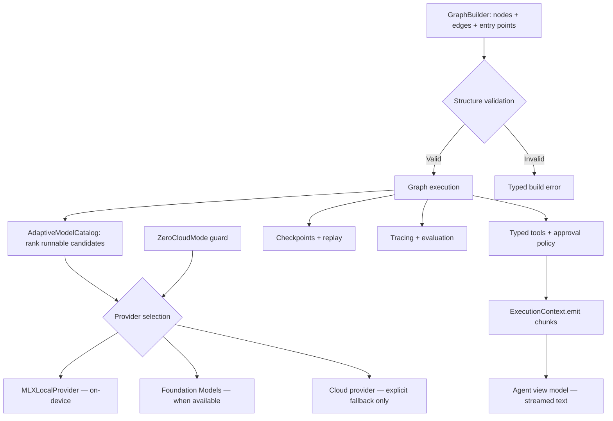

# ArchonAgent — how it works

`ArchonAgent` executes provider-routed agent graphs with typed tools,
interrupts, checkpointing, evaluation, and observability. It requests model
selection from `ArchonModels` descriptors but never downloads models itself.

`MLXLocalProvider` fails closed when MLX is not linked. Streaming commits
completed text as an assistant chat message.
