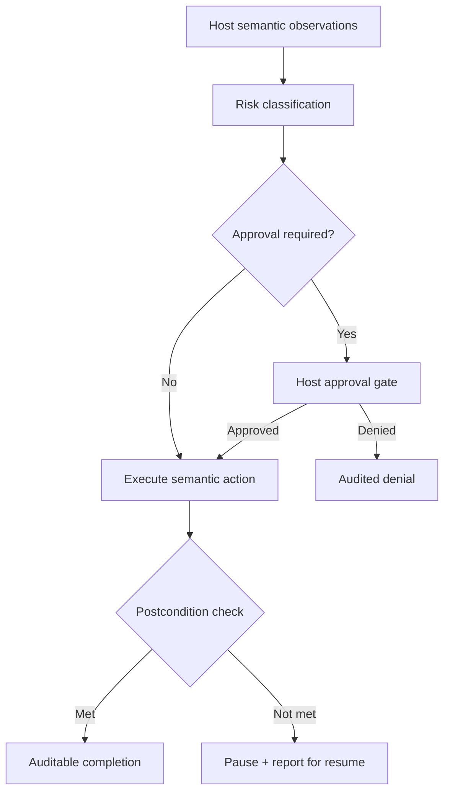

# ArchonComputerUse — how it works

`ArchonComputerUse` is a semantic controller over host-app observations. It
uses semantic actions and postconditions — screen coordinates are never the
primary contract. Host apps supply observations, entitlements, and
permissions.

Pause/resume keeps long-running tasks auditable. Live behavior is validated
only in a signed consuming app.
