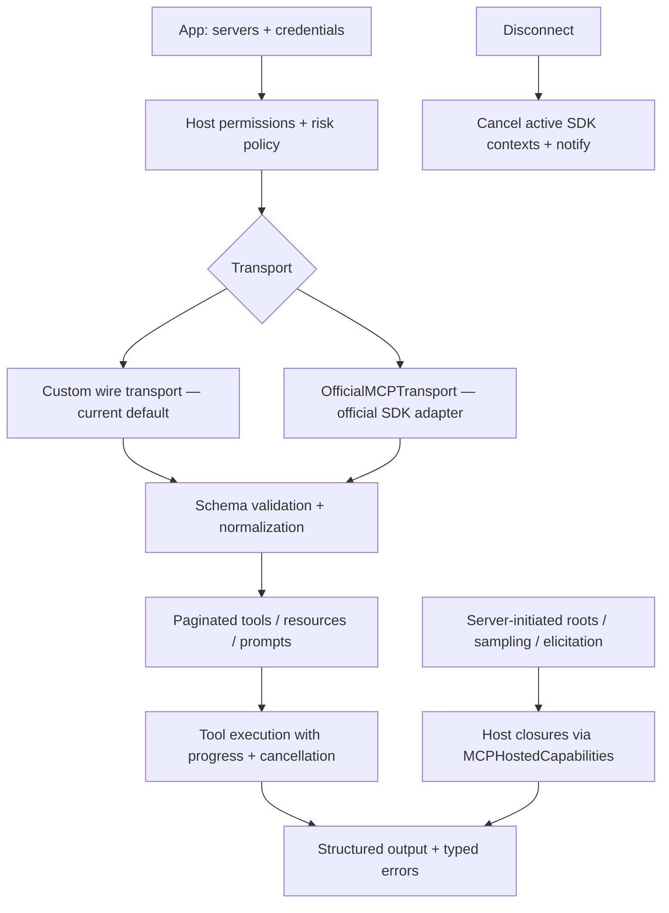

# ArchonConnect — how it works

`ArchonConnect` owns MCP transport, schema validation, streaming, and
permissions. Archon value types and policy stay in front; the official MCP
Swift SDK backs the `OfficialMCPTransport` adapter behind the
vendor-neutral transport surface.

Endpoint policy, auth/header ownership, lifecycle, and error boundaries
remain Archon's. The custom transport stays until full conformance and
production-server lifecycle evidence close. Hosted capabilities install
before `connect()` and advertise exactly what the host implements.
