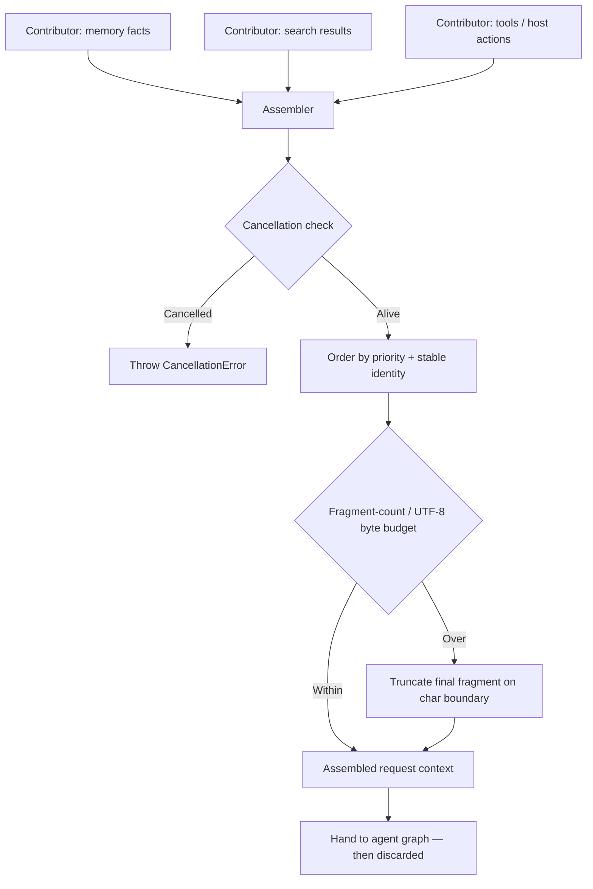

# ArchonContext — how it works

`ArchonContext` is an ephemeral, request-scoped assembler. It orders
contributor fragments deterministically and enforces budgets. It does not
persist, retrieve, or mutate memory.

Durable facts and filtering stay in `ArchonMemory`. Model-specific token
budgets remain consuming-app concerns.
