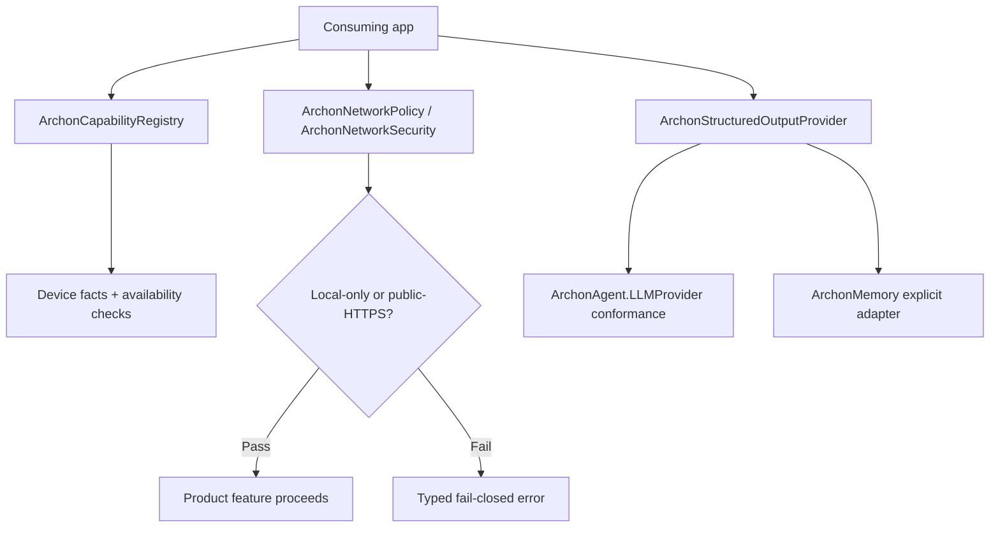

# ArchonCore — how it works

`ArchonCore` supplies shared primitives only: capabilities, policy, typed
errors, device facts, identifiers, network guards, and the vendor-neutral
structured-output contract. It contains no memory, search, inference, MCP,
sandbox, or Computer Use implementation.

Cross-module composition uses protocols and host injection; products depend
on `ArchonCore`, never the reverse.
