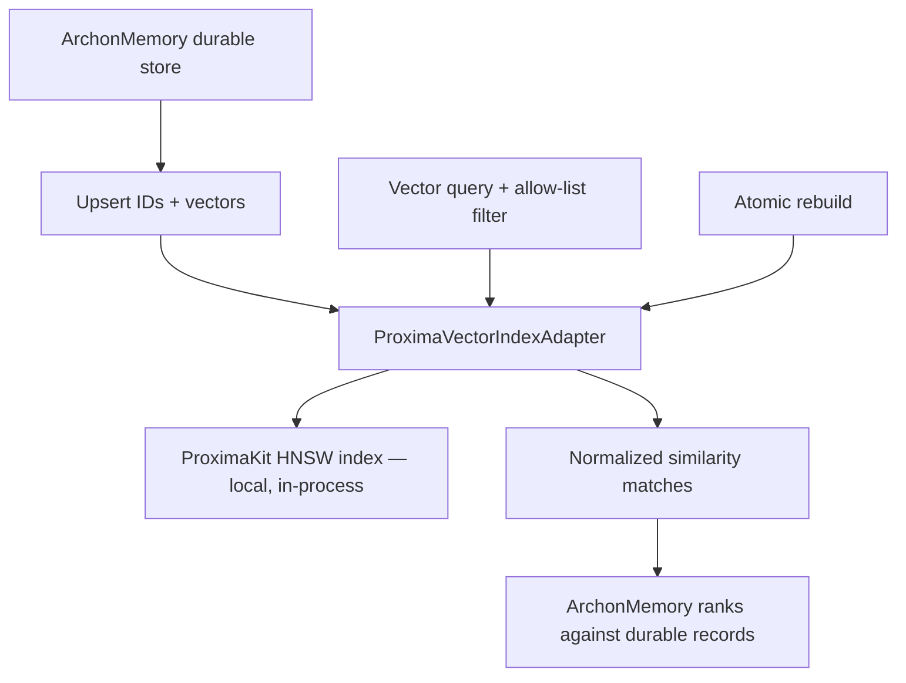

# ArchonMemoryProxima — how it works

`ArchonMemoryProxima` is an optional dense-vector adapter that composes
ProximaKit behind `ArchonMemory`'s vendor-neutral `VectorIndex` seam. It is
excluded from `ArchonFull` until persistence, recovery, and device-scale
gates close.

No ProximaKit type enters Archon's public API. Durable records, filtering,
history, and recovery stay owned by `ArchonMemory`.
