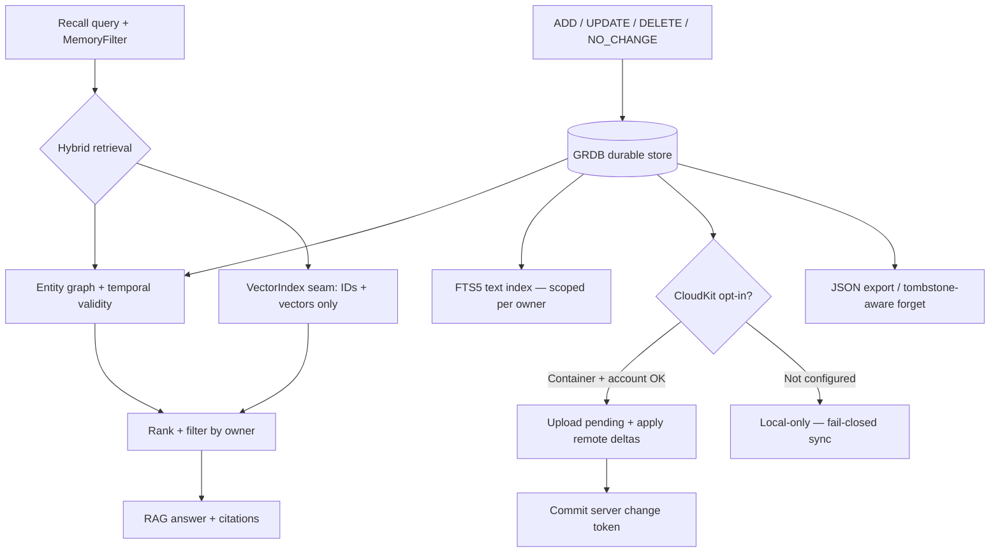

# ArchonMemory — how it works

`ArchonMemory` owns durable memory: fact lifecycle, entity graph,
hybrid graph/vector retrieval, RAG, and optional CloudKit sync. The GRDB
store is the source of truth; dense indexes plug in only through the
vendor-neutral `VectorIndex` seam.

Indexes may hold only IDs and vectors — never memory metadata or lifecycle
state. Retrieval enforces exact owner filtering.
