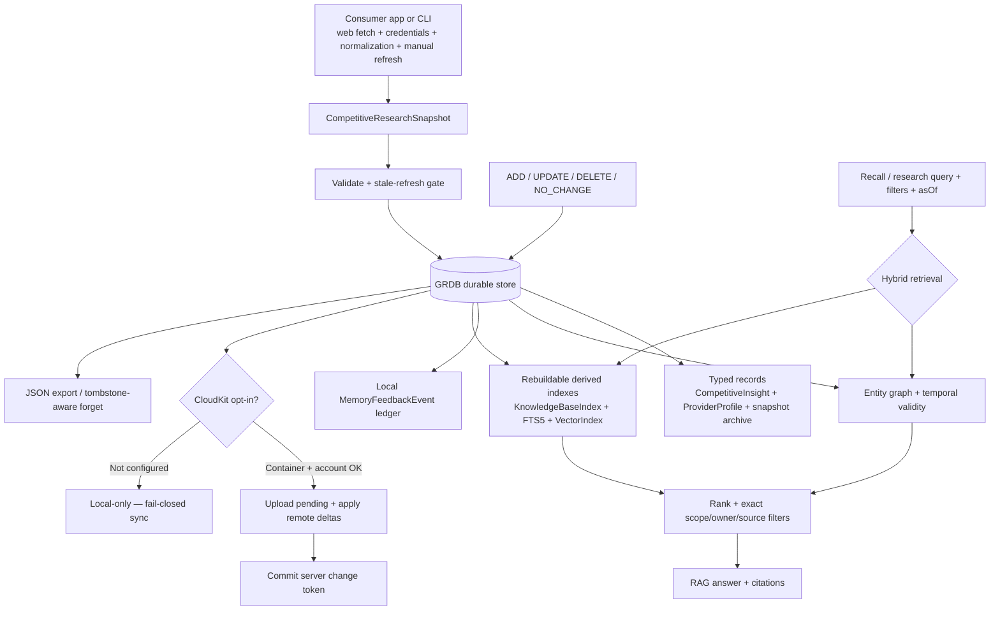

# ArchonMemory — how it works

`ArchonMemory` owns durable memory and the source-linked competitive research
archive. The consuming app or CLI owns web fetching, provider credentials,
source normalization, and manual refresh. The package validates imported
snapshots, stores canonical source metadata in GRDB, and derives searchable
indexes that can be rebuilt after restart.

The GRDB store is the source of truth. Indexes may hold only IDs and vectors —
never memory metadata or lifecycle state — and are rebuilt from canonical rows
after restart. A stale research import cannot overwrite a newer snapshot,
insight, or provider profile. Retrieval enforces exact owner and scope
filtering, while feedback remains local and is never treated as source
evidence.
