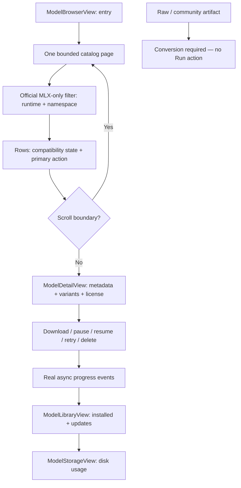

# ArchonModelsUI — how it works

`ArchonModelsUI` is the optional embeddable SwiftUI surface for model
discovery and library management. It consumes injected `ModelLibrary`,
catalog, device, and download-manager instances — it owns no store itself.
User-facing discovery is official-publisher MLX-only via
`OfficialModelCatalog`.

All views use semantic colors/materials and adapt to Light/Dark mode. No
hard-coded hex colors.
