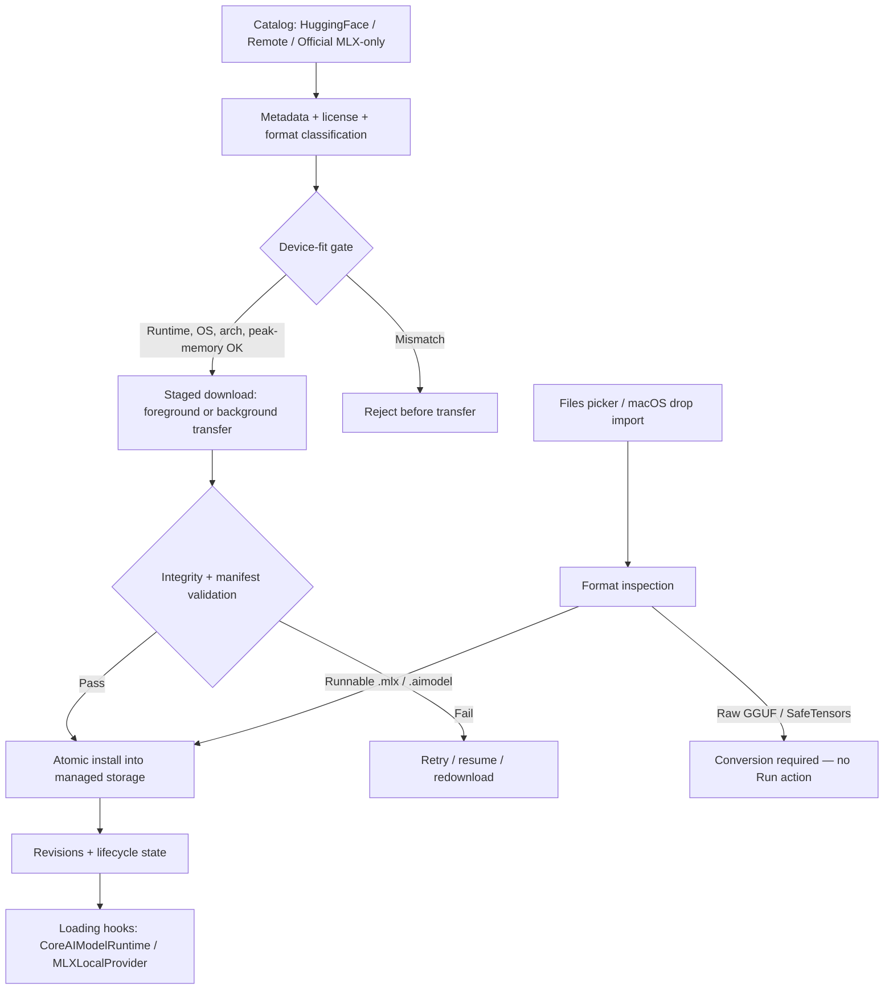

# ArchonModels — how it works

`ArchonModels` owns the model lifecycle: catalog discovery, format
inspection, device-fit gating, staged downloads, integrity validation,
atomic installation, revisions, storage, and loading hooks.

A runnable artifact without a peak-memory declaration is rejected unless a
bounded estimate can be derived. Download entry points fail before transfer
when the variant cannot run on the current device.
