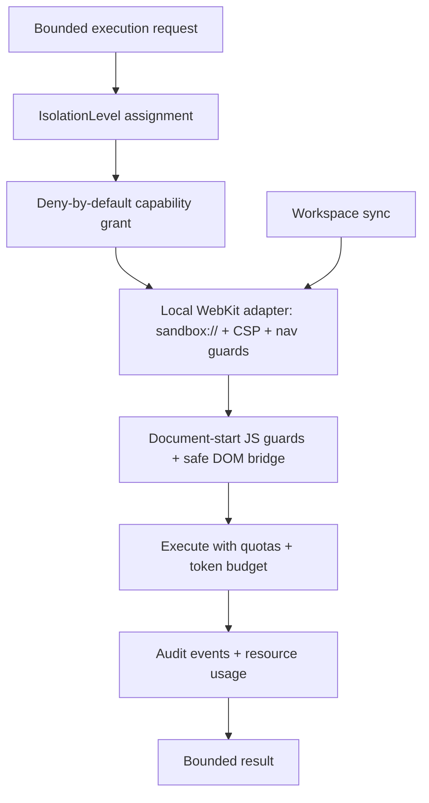

# ArchonSandbox — how it works

`ArchonSandbox` owns capability-restricted mini-app execution behind the
provider-neutral `SandboxExecutionProvider` contract. The local adapter is
in-process WebKit — a capability boundary, never claimed as VM-grade
isolation.

Page-originated host-tool capabilities are required; remote sandboxes may
only arrive as explicit adapters with lifecycle and teardown evidence.
