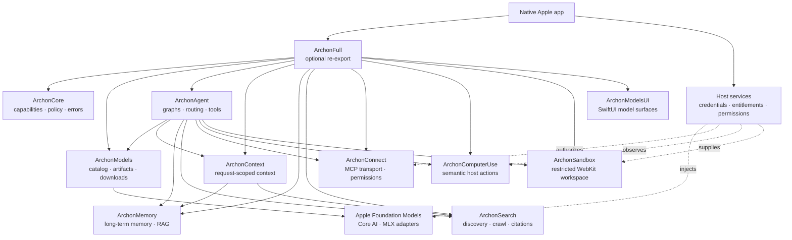

# Archon Swift

[](https://www.swift.org)
[](https://developer.apple.com)

Archon is a modular, local-first Swift SDK for building native AI features on
Apple platforms. It composes model lifecycle, agent graphs, context, memory,
research, tools, sandboxing, MCP, semantic actions, and SwiftUI surfaces.

Each product is independently adoptable. `ArchonFull` is the optional
all-base-products re-export; optional adapters remain separate.

## At a glance

| Property | Value |
| --- | --- |
| Language | Swift 6.4, strict-concurrency settings |
| Platforms | iOS 27, macOS 27, visionOS 27 |
| Package manager | Swift Package Manager |
| Runtime posture | Apple-first; Core AI and MLX adapters where available |
| Default safety posture | Typed errors, bounded operations, fail closed |
| App boundary | The consuming app owns credentials, entitlements, permissions, and host adapters |

## Why Archon

- Native Swift APIs instead of a server-first control plane.
- Local model discovery, compatibility checks, downloads, validation, and installation.
- Composable agent graphs with model routing, tools, interrupts, checkpoints, and evaluation.
- Application-owned memory and RAG with optional CloudKit synchronization.
- Search and research outputs with citations and an inspectable search path.
- Permission-aware MCP, semantic host actions, and capability-restricted WebKit sandboxes.
- No fabricated inference, extraction, search, telemetry, or platform records when a required capability is unavailable.

## System design



Arrows show composition and service boundaries, not the complete SwiftPM
dependency graph. Read [`Documentation/architecture.md`](Documentation/architecture.md)
for the deeper design notes.

## Products

| Product | Responsibility |
| --- | --- |
| `ArchonCore` | Shared capabilities, device facts, policy, logging, and errors |
| `ArchonModels` | Catalogs, model formats, compatibility, downloads, manifests, and lifecycle |
| `ArchonAgent` | Stateful graphs, routing, providers, tools, interrupts, checkpoints, evaluation, and SwiftUI chat |
| `ArchonContext` | Request-scoped context assembly; never persists or executes actions |
| `ArchonMemory` | Application-owned memory, graph storage, vector search, RAG, and CloudKit sync |
| `ArchonMemoryProxima` | Optional ProximaKit dense-index adapter behind `VectorIndex` |
| `ArchonSearch` | Search, scraping, deep research, structured extraction, citations, and monitoring |
| `ArchonSandbox` | Capability-restricted WebKit mini-apps, DOM/JS patches, events, and workspace sync |
| `ArchonConnect` | MCP client, JSON-RPC HTTP transport, schema validation, and permission policy |
| `ArchonComputerUse` | Semantic snapshots and host-defined actions with risk and postcondition checks |
| `ArchonModelsUI` | SwiftUI model discovery, installed-library, detail, storage, and download views |
| `ArchonFull` | Convenience re-export of the base SDK products; excludes optional `ArchonMemoryProxima` |

## Dependency and product policy

The package is layered so an app can adopt only what it needs. `ArchonFull`
re-exports the base SDK products, but it does not pull in the optional Proxima
index adapter. Cloud models, search services, remote MCP servers, and remote
sandboxes belong behind the consuming app's explicit adapter and permission
boundary.

| If you need… | Import | Additional dependency scope |
| --- | --- | --- |
| Shared policies, device facts, errors | `ArchonCore` | None |
| Catalogs, artifacts, downloads, model UI | `ArchonModels`, `ArchonModelsUI` | Runtime integrations are opt-in at the API boundary |
| Graph agents and local model adapters | `ArchonAgent` | MLX, MLX LM, Hugging Face, Transformers, and Swift macros |
| Durable memory and RAG | `ArchonMemory` | GRDB/SQLite |
| Alternative dense indexing | `ArchonMemoryProxima` | ProximaKit; optional and not included in `ArchonFull` |
| MCP connectivity | `ArchonConnect` | Official MCP Swift SDK |
| Search, sandbox, semantic actions | `ArchonSearch`, `ArchonSandbox`, `ArchonComputerUse` | Archon-owned contracts; integrations remain explicit |

No cloud-vendor SDK is required by the base local policies. Cloud models,
search services, remote MCP servers, and remote sandboxes belong behind the
consuming app's explicit adapter and permission boundary.

## Competitive comparison

This matrix is intentionally concise. Each competitor column names the
reference set being compared; it does not imply identical scope or market
share. The `Native Swift / local in-process core` row is the strict local
qualification gate. Detailed evidence, user-pull signals, decisions, and
quality gates live in the [competitor registry](context/competitor-signature-features.md),
[adoption backlog](context/feature-adoption-backlog.md), and [quality
scorecard](context/quality-scorecard.md).

| Capability | Archon | Apple<br>Foundation Models<br>Core ML<br>WebKit<br>CloudKit<br>SwiftUI<br>App Intents | Memory<br>Mem0<br>Supermemory<br>Zep<br>Letta<br>CrewAI Memory | Agents<br>LangGraph<br>CrewAI<br>OpenAI Agents SDK<br>LlamaIndex<br>PydanticAI | Search/research<br>Tavily<br>Exa<br>Firecrawl<br>Brave Search<br>Perplexity<br>ChatGPT Search<br>SerpAPI<br>SearXNG<br>Perplexica | Sandbox/browser<br>E2B<br>Modal<br>Daytona<br>Deno Sandbox<br>Browserbase<br>Stagehand<br>TinyFish<br>OpenAI Computer Use<br>Anthropic Computer Use | Models/runtimes<br>MLX Swift<br>Hugging Face Swift<br>AnyLanguageModel<br>Conduit<br>SwiftAgent<br>AgentRunKit<br>Swarm | Protocols<br>MCP Swift SDK<br>A2A<br>AG-UI |
| --- | :---: | :---: | :---: | :---: | :---: | :---: | :---: | :---: |
| Native Swift / local in-process core | ✅ | ✅ | ❌ | ❌ | ❌ | ❌ | ✅ | ⚠️ |
| On-device model runtime | ✅ | ✅ | ❌ | ⚠️ | ❌ | ❌ | ✅ | ❌ |
| Model catalog and lifecycle | ✅ | ⚠️ | ❌ | ❌ | ❌ | ❌ | ⚠️ | ❌ |
| Agent graphs | ✅ | ❌ | ❌ | ✅ | ❌ | ❌ | ⚠️ | ❌ |
| Durable checkpoints and replay | ✅ | ❌ | ❌ | ✅ | ❌ | ❌ | ⚠️ | ❌ |
| Tools and handoffs | ✅ | ✅ | ⚠️ | ✅ | ⚠️ | ✅ | ⚠️ | ✅ |
| Durable memory and RAG | ✅ | ❌ | ✅ | ⚠️ | ⚠️ | ❌ | ⚠️ | ❌ |
| Web research and citations | ✅ | ⚠️ | ❌ | ⚠️ | ✅ | ⚠️ | ❌ | ❌ |
| Offline local-corpus search | ✅ | ⚠️ | ❌ | ❌ | ⚠️ | ❌ | ❌ | ❌ |
| Secure execution boundary | ⚠️ | ⚠️ | ❌ | ❌ | ❌ | ✅ | ❌ | ❌ |
| Semantic host actions | ⚠️ | ✅ | ❌ | ⚠️ | ❌ | ✅ | ⚠️ | ❌ |
| MCP tools, resources, and prompts | ✅ | ❌ | ❌ | ⚠️ | ⚠️ | ⚠️ | ⚠️ | ✅ |
| CloudKit synchronization | ✅ | ✅ | ❌ | ❌ | ❌ | ❌ | ❌ | ❌ |
| SwiftUI and App Intents surfaces | ✅ | ✅ | ❌ | ❌ | ❌ | ❌ | ⚠️ | ❌ |
| Network and isolation disclosure | ✅ | ⚠️ | ❌ | ❌ | ⚠️ | ✅ | ⚠️ | ⚠️ |

Legend: ✅ strong or qualifying support · ⚠️ mixed, partial, hosted, optional,
adapter-owned, or host-dependent · ❌ no meaningful equivalent in the named
reference set. For provider-by-provider evidence, use the linked registry.

### What Archon promises

| Dimension | Archon default | Cloud/remote extension |
| --- | --- | --- |
| Execution | Primarily on the user's Apple device, in-process, native Swift | Explicit opt-in adapters for hosted models, search, MCP, browsers, or sandboxes |
| Privacy | `localOnly` never calls the network; credentials belong to the host app | Every cloud boundary is policy-controlled and observable |
| Apple integration | Reuse Foundation Models, Core ML, WebKit, SwiftUI, CloudKit, App Intents, and Accessibility | Do not replace an Apple framework that already satisfies the requirement |
| Data ownership | ArchonMemory and ArchonContext remain application-owned and auditable | Sync and hosted indexes are optional, explicit, and never silently authoritative |
| Quality bar | Typed failures, strict concurrency, cancellation, bounded resources, recovery, and migration | Adapters disclose limitations and pass the same contract tests |
| Isolation honesty | In-process WebKit is labelled WebKit, not a process/container/microVM | Remote isolation levels are represented explicitly by the adapter |

## Local and network policy

| Capability | Local-first behavior | Explicit network/remote behavior |
| --- | --- | --- |
| Model routing | `ModelPolicy.localOnly`, `appleOnly`, or `preferLocal` selects an on-device path when available | `cloudAllowed` or an explicit cloud provider may cross the host's network boundary |
| Search | `SearchNetworkPolicy.localOnly` accepts a local workspace source and rejects network discovery | `SearchNetworkPolicy.networkAllowed` is required for web/cloud sources |
| Sandbox | `InProcessWebKitExecutionProvider` reports `.inProcessWebKit` and defaults to denied capabilities | Remote container/microVM providers must report their isolation and network dependence |
| Credentials | The consuming app supplies and stores credentials | No API key is embedded in package defaults or silently inferred |

`localOnly` is a hard policy. If a local capability is unavailable, Archon
returns a typed error or unavailable result; it does not silently fall back to
the network.

## Quick start

Add the package URL in Xcode or Swift Package Manager. Pin a release tag or
commit in production for reproducible builds:

```swift
.package(url: "https://github.com/VM451/archon-swift.git", branch: "main")
```

Inspect a local model library without introducing a network request:

```swift
import Foundation
import ArchonModels

func findCompatibleModels(in libraryURL: URL) async throws -> [ModelDescriptor] {
    let catalog = LocalModelCatalog(locations: [libraryURL])
    return try await catalog.search(
        ModelSearchRequest(
            query: "",
            compatibleOnly: true,
            device: ArchonDeviceCapabilities.current
        )
    )
}
```

For network-backed Hugging Face discovery, use the separate catalog explicitly
and let the host app decide whether network access is permitted.

```swift
import ArchonModels

func searchHuggingFace() async throws -> [ModelDescriptor] {
    let catalog = HuggingFaceCatalog(tokenStore: KeychainModelTokenStore())
    return try await catalog.search(
        ModelSearchRequest(query: "Qwen", compatibleOnly: true,
                           device: ArchonDeviceCapabilities.current)
    )
}
```

Catalog results can be empty, and a compatible model can still require a
model-family text adapter supplied by the consuming app. Never assume the
first result is runnable; inspect the returned variant and run
`ModelCompatibilityAnalyzer` before presenting an install or load action.

The buildable example is a macOS SwiftPM executable:

```bash
swift run archon-example-app
```

iOS and visionOS validation requires a consuming Xcode application with the
appropriate entitlements, usage descriptions, permissions, and host lifecycle
forwarding. This package-only checkout does not provide a signed `.app`.

## Model lifecycle

`ArchonModels` supports static, local-library, direct-URL, Apple Core AI, and
HTTP-backed catalogs; Hugging Face metadata; Keychain-backed tokens;
device-fit analysis; single-file or directory artifacts; checksum and resource
validation; resumable foreground/background downloads; atomic installation;
revision checks; and App Intents. `LocalModelCatalog` is offline.
HTTP-backed catalogs are network-dependent and must be selected deliberately by
the host app.

Runnable Core AI and MLX artifacts are distinct from raw `GGUF`, `SafeTensors`,
and Transformers files. Unsupported or conversion-required artifacts are never
reported as Ready. See [`Documentation/model-format.md`](Documentation/model-format.md).

The developer-only `archon-model` executable handles inspection, validation,
packaging, conversion through Apple's `coreai-models` exporter, and local
artifact preparation benchmarks.

## Evidence status

The maintained [competitor signature registry](context/competitor-signature-features.md)
records capability evidence separately from independent user-pull evidence. A
feature is not called “user-loved” from official documentation alone. The
[adoption backlog](context/feature-adoption-backlog.md) maps each outcome to an
Archon product, decision, priority, and definition of done. The [quality
scorecard](context/quality-scorecard.md) defines the weighted score and the
gates required before a replacement becomes the default.

The current package evidence is 325 Swift tests across 10 bundles, independent
product builds, simulator compilation, dependency-scope checks, and license
inventory checks. Signed-app, physical-device, live UI, real-model, and
production-server validation remain explicit release gates.

## Build and test

```bash
swift package dump-package
swift build -j 2
swift test -j 2
swift Tools/verify-product-scope.swift
swift Tools/verify-dependency-licenses.swift
```

Optional live research tests and timing-sensitive benchmarks are disabled by
default. Run the opt-in checks from [`Benchmarks/README.md`](Benchmarks/README.md)
only on a controlled development machine; their timings are not portable
device guarantees.

## Integration boundaries

The package is a SwiftPM library family with a buildable SwiftUI example host,
not a signed Xcode application. A production app supplies its own:

- model tokenizer/text adapters and provider credentials;
- privacy usage descriptions, entitlements, and platform permissions;
- MCP servers, search services, lifecycle forwarding, and host semantic observations;
- user-facing policy for side effects and data retention.

When one of these boundaries is absent, the relevant API returns a typed error
or unavailable result. Test and preview code can inject deterministic mocks.

## Documentation

- [`Documentation/README.md`](Documentation/README.md) — documentation index organized by tutorials, how-to guides, reference, explanation, and decisions.
- [`Documentation/architecture.md`](Documentation/architecture.md) — compatibility entry point for focused architecture documents.
- [`Documentation/model-format.md`](Documentation/model-format.md) — compatibility entry point for model contracts, catalogs, and lifecycle.
- [`Documentation/migration-audit.md`](Documentation/migration-audit.md) — compatibility entry point for the migration decision record.
- [`Documentation/tutorials/`](Documentation/tutorials/) — end-to-end local model tutorial.
- [`Documentation/how-to/`](Documentation/how-to/) — integration, lifecycle, MCP, sandbox, semantic action, and release guides.
- [`Documentation/reference/`](Documentation/reference/) — product, model, policy, and executable contracts.
- [`Documentation/explanation/`](Documentation/explanation/) — architecture, dependency, local-first, and recovery rationale.
- [`Documentation/decisions/`](Documentation/decisions/) — migration and architectural decision records.
- [`context/competitor-signature-features.md`](context/competitor-signature-features.md) — capability evidence and local/native qualification.
- [`context/feature-adoption-backlog.md`](context/feature-adoption-backlog.md) — feature decisions, priorities, and definitions of done.
- [`context/quality-scorecard.md`](context/quality-scorecard.md) — replacement gates for correctness, safety, performance, and migration.
- [`context/progress-tracker.md`](context/progress-tracker.md) — dated implementation and verification record.
- [`Examples/README.md`](Examples/README.md) — buildable SwiftUI host.
- [`Benchmarks/README.md`](Benchmarks/README.md) — opt-in performance checks.

## Governing rule

Use Apple when Apple already solves the problem. Add only the missing adapter
when it does not. Report unsupported behavior honestly when no safe adapter
exists.
