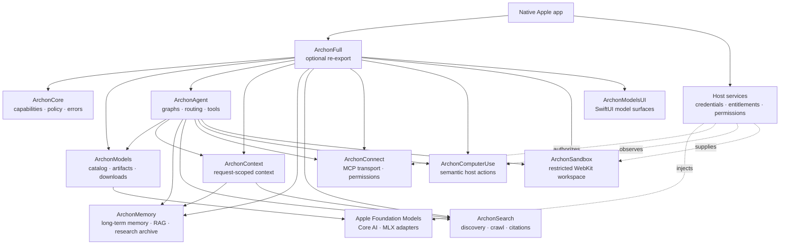

# Archon Swift

[](https://www.swift.org)
[](https://developer.apple.com)

Archon is a modular, local-first Swift SDK for building native AI features on
Apple platforms. It composes model lifecycle, agent graphs, context, memory,
research, tools, sandboxing, MCP, semantic actions, and SwiftUI surfaces.

Each product is independently adoptable. `ArchonFull` is the optional
all-base-products re-export; optional adapters remain separate.

## At a glance

| Property | Value |
| --- | --- |
| Language | Swift 6.4, strict-concurrency settings |
| Platforms | iOS 27, macOS 27, visionOS 27 |
| Package manager | Swift Package Manager |
| Runtime posture | MLX Swift and Hugging Face/Transformers support is bundled with `ArchonAgent` for out-of-the-box local inference; user-facing browsing is official-publisher MLX-only |
| Default safety posture | Typed errors, bounded operations, fail closed |
| App boundary | The consuming app owns credentials, entitlements, permissions, and host adapters |

## Why Archon

- Native Swift APIs instead of a server-first control plane.
- Local model discovery, compatibility checks, downloads, validation, and installation.
- Composable agent graphs with model routing, tools, interrupts, checkpoints, and evaluation.
- Application-owned memory and RAG with optional CloudKit synchronization.
- Source-linked competitive research snapshots with local profiles, filtered
  insight recall, stale-refresh protection, and exportable provenance.
- Search and research outputs with citations and an inspectable search path.
- Permission-aware MCP, semantic host actions, and capability-restricted WebKit sandboxes.
- Hosted MCP roots, sampling, and elicitation served from app-owned closures.
- No fabricated inference, extraction, search, telemetry, or platform records when a required capability is unavailable.

## System design



Arrows show composition and service boundaries, not the complete SwiftPM
dependency graph. Read [`Documentation/architecture.md`](Documentation/architecture.md)
for the deeper design notes.

## Products

One table per product: what it does, the build decision, and the reuse-or-audit
first action. The full decision vocabulary and dependency policy live in the
[decision framework](Documentation/reference/decision-framework.md). A link is
an audit target, not an adoption decision — `BUILD` means Archon owns the
missing local behavior after the audit; it never means Apple APIs are ignored.

The `Honest winner` column is a plain-language verdict per row. Archon runs
locally on the user's device with no required hosting, so it wins some rows
on local-first grounds and honestly loses others on hosted scale or ecosystem
maturity — that tradeoff is intentional. Scores and evidence live in the
[competitor comparison](Documentation/reference/competitor-comparison.md);
latency/recall device proof lives in [Benchmarks](Benchmarks/README.md).

| Product | What it does | Honest winner | Decision | Reuse or audit first |
| --- | --- | --- | --- | --- |
| `ArchonCore` | Capabilities, device facts, policy, logging, errors | 🤝 Split — Apple/upstream wins primitives (reused by design); Archon wins the unified policy/error layer | PARTIAL / ADAPT | Apple facts; [swift-foundation](https://github.com/apple/swift-foundation), [swift-system](https://github.com/apple/swift-system), [swift-log](https://github.com/apple/swift-log), [swift-crypto](https://github.com/apple/swift-crypto) |
| `ArchonModels` | Catalogs, formats, compatibility, downloads, manifests, lifecycle | 🤝 Split — Hugging Face wins catalog breadth; Archon wins native lifecycle + official-publisher MLX browsing | PARTIAL / ADAPT | Apple runtimes; [mlx-swift](https://github.com/ml-explore/mlx-swift), [mlx-swift-lm](https://github.com/ml-explore/mlx-swift-lm), [swift-huggingface](https://github.com/huggingface/swift-huggingface), [swift-transformers](https://github.com/huggingface/swift-transformers) |
| `ArchonAgent` | Graphs, routing, tools, interrupts, checkpoints, evaluation, chat | 🏆 Archon on-device — crash/reopen/replay/fork proven; LangGraph still leads hosted/Python ecosystem maturity | BUILD | [langgraph](https://github.com/langchain-ai/langgraph), [crewAI](https://github.com/crewAIInc/crewAI), [openai-agents-python](https://github.com/openai/openai-agents-python), [AgentRunKit](https://github.com/Tom-Ryder/AgentRunKit), [Conduit](https://github.com/christopherkarani/Conduit) |
| `ArchonContext` | Request-scoped assembly; never persists or executes | 🏆 Archon — no local rival for deterministic request assembly; cloud memory is a different job | BUILD | [mem0](https://github.com/mem0ai/mem0), [letta](https://github.com/letta-ai/letta), [zep](https://github.com/getzep/zep) |
| `ArchonMemory` | Durable memory, graph/vector search, RAG, source-linked research, CloudKit sync | 🏆 Archon on-device — beats Wax (6.4x ingest, 1.4x p95, equal recall); hosted rivals win zero-ops convenience | ADAPT + BUILD | GRDB + existing stores; [mem0](https://github.com/mem0ai/mem0), [supermemory](https://github.com/supermemoryai/supermemory), [graphiti](https://github.com/getzep/graphiti), [letta](https://github.com/letta-ai/letta), [Wax](https://github.com/christopherkarani/Wax), [ProximaKit](https://github.com/vivekptnk/ProximaKit), [RecallKit](https://github.com/gregyoung14/RecallKit) |
| `ArchonMemoryProxima` | Optional dense-index adapter behind `VectorIndex` | 🏆 Archon leads — beats USearch 2.8x on iPhone 16 at equal recall; stays optional until recovery/ceiling gates close | PARTIAL / ADAPT | [ProximaKit](https://github.com/vivekptnk/ProximaKit), [RecallKit](https://github.com/gregyoung14/RecallKit), [Wax](https://github.com/christopherkarani/Wax); device fit first |
| `ArchonSearch` | On-device search, neural + keyword rerank, freshness, registry fan-out, extraction, grounding, citations, chat UI | 🚩 Rivals win whole-web scale (structural) · 🏆 Archon wins offline corpus, privacy, explicit policy | PARTIAL / ADAPT | DuckDuckGo engine, local `ResultReranker`/`NaturalLanguageSimilarity`/`SearchRankingOptions`/`SearchQueryRewriter`/`SearchEngineRegistry`, [SwiftSoup](https://github.com/scinfu/SwiftSoup) + Readability bridge, [GRDB](https://github.com/groue/GRDB.swift); companions [searxng](https://github.com/searxng/searxng), [crawl4ai](https://github.com/unclecode/crawl4ai); audit [tavily-python](https://github.com/tavily-ai/tavily-python), [exa-py](https://github.com/exa-labs/exa-py), [firecrawl](https://github.com/mendableai/firecrawl), [Perplexica](https://github.com/ItzCrazyKns/Perplexica) |
| `ArchonSandbox` | Capability-restricted WebKit mini-apps and workspace sync | 🚩 Rivals win isolation strength (microVM, structural) · 🏆 Archon wins native in-process embedding + policy | BUILD | WebKit; [e2b](https://github.com/e2b-dev/e2b), [modal-client](https://github.com/modal-labs/modal-client), [daytona](https://github.com/daytonaio/daytona), [deno](https://github.com/denoland/deno) |
| `ArchonConnect` | MCP client, transports, schema validation, permissions, hosted capabilities | 🤝 Split — official SDK wins wire protocol (adapted); Archon wins permission/policy + hosted capabilities | PARTIAL / ADAPT | [swift-sdk](https://github.com/modelcontextprotocol/swift-sdk); audit [servers](https://github.com/modelcontextprotocol/servers) |
| `ArchonComputerUse` | Semantic snapshots, approvals, host actions, postconditions | 🚩 Rivals win automation breadth · 🏆 Archon wins semantic-first safety (approvals, postconditions, no coordinate taps) | BUILD | Accessibility/DOM/App Intents; [stagehand](https://github.com/browserbase/stagehand), [anthropic-cookbook](https://github.com/anthropics/anthropic-cookbook) |
| `ArchonModelsUI` | Model discovery, library, detail, storage, download views | 🤝 Split — LM Studio/Jan win full-app UX maturity; Archon wins embeddable native SwiftUI | BUILD | SwiftUI; [swift-book](https://github.com/apple/swift-book), [swift-navigation](https://github.com/pointfreeco/swift-navigation) |
| `ArchonFull` | Re-export of the base products; excludes `ArchonMemoryProxima` | — (facade; no matchup) | REUSE | Dependency scope only |

Developer tools: `archon-model` (offline model workflows via
[swift-argument-parser](https://github.com/apple/swift-argument-parser)) and
`archon-example-app` (golden SwiftUI host) are both BUILD, reusing the
patterns above.

## Quick start

Add the package URL in Xcode or Swift Package Manager. Pin a release tag or
commit in production for reproducible builds. Replace the placeholder with the
exact release commit you have verified:

```swift
.package(url: "https://github.com/VM451/archon-swift.git", revision: "<verified-release-commit>")
```

Inspect a local model library without introducing a network request:

```swift
import Foundation
import ArchonModels

func findCompatibleModels(in libraryURL: URL) async throws -> [ModelDescriptor] {
    let catalog = MLXModelCatalog(provider: LocalModelCatalog(locations: [libraryURL]))
    return try await catalog.search(
        ModelSearchRequest(
            query: "",
            runtime: .mlx,
            format: .mlx,
            compatibleOnly: true,
            device: ArchonDeviceCapabilities.current
        )
    )
}
```

For network-backed Hugging Face discovery, use the official-publisher wrapper
and let the host app decide whether network access is permitted.

```swift
import ArchonModels

func searchHuggingFace() async throws -> [ModelDescriptor] {
    let catalog = OfficialModelCatalog(
        provider: HuggingFaceCatalog(tokenStore: KeychainModelTokenStore())
    )
    return try await catalog.search(
        ModelSearchRequest(query: "Qwen", task: .textGeneration, runtime: .mlx, format: .mlx,
                           compatibleOnly: true,
                           device: ArchonDeviceCapabilities.current)
    )
}
```

For Hugging Face, `OfficialModelCatalog` first applies the MLX runtime/format
gate and then requires the descriptor and variant to share an allow-listed
first-party namespace. Catalog results can be empty, and a compatible model
can still require a model-family text adapter supplied by the consuming app.
Never assume the first result is runnable; inspect the returned variant and
run `ModelCompatibilityAnalyzer` before presenting an install or load action.

## Build and test

```bash
swift package dump-package
swift build -j 2
swift test -j 2
swift Tools/verify-competitor-scorecard.swift
swift Tools/verify-product-scope.swift
swift Tools/verify-dependency-licenses.swift
```

Optional live research tests and timing-sensitive benchmarks are disabled by
default. Run the opt-in checks from [`Benchmarks/README.md`](Benchmarks/README.md)
only on a controlled development machine; macOS timings are not portable
device guarantees. First iPhone 16 latency/recall evidence for the vector
path is recorded in the same document.

## Documentation

- [`Documentation/README.md`](Documentation/README.md) — documentation index organized by tutorials, how-to guides, reference, explanation, and decisions.
- [`Documentation/architecture.md`](Documentation/architecture.md) — compatibility entry point for focused architecture documents.
- [`Documentation/model-format.md`](Documentation/model-format.md) — compatibility entry point for model contracts, catalogs, and lifecycle.
- [`Documentation/migration-audit.md`](Documentation/migration-audit.md) — compatibility entry point for the migration decision record.
- [`Documentation/tutorials/`](Documentation/tutorials/) — end-to-end local model tutorial.
- [`Documentation/how-to/`](Documentation/how-to/) — integration, lifecycle, MCP, sandbox, semantic action, and release guides.
- [`Documentation/reference/`](Documentation/reference/) — product, model, policy, and executable contracts.
- [`Documentation/reference/supported-models.md`](Documentation/reference/supported-models.md) — official-publisher MLX discovery, supported model families, catalog wiring, and the Gemma compatibility explanation.
- [`Documentation/reference/competitor-comparison.md`](Documentation/reference/competitor-comparison.md) — detailed competitor feature tables, scores, and Archon-fit decisions.
- [`Documentation/reference/products/memory.md`](Documentation/reference/products/memory.md) — ArchonMemory contracts, durable research imports, and local feedback boundaries.
- [`Documentation/explanation/`](Documentation/explanation/) — architecture, dependency, local-first, and recovery rationale.
- [`Documentation/decisions/`](Documentation/decisions/) — migration and architectural decision records.
- [`Documentation/diagrams/archon-search.md`](Documentation/diagrams/archon-search.md) — ArchonSearch 2.0 dual-retrieval and grounding architecture.
- [`Documentation/diagrams/archon-memory.md`](Documentation/diagrams/archon-memory.md) — durable memory, RAG, competitive research, stale-refresh, and export flow.
- [`Documentation/how-to/validate-a-release.md`](Documentation/how-to/validate-a-release.md) — replacement gates for correctness, safety, performance, and migration.
- [`Examples/README.md`](Examples/README.md) — buildable SwiftUI host.
- [`Benchmarks/README.md`](Benchmarks/README.md) — opt-in performance checks.

## Governing rule

Use Apple when Apple already solves the problem. Add only the missing adapter
when it does not. Report unsupported behavior honestly when no safe adapter
exists.
