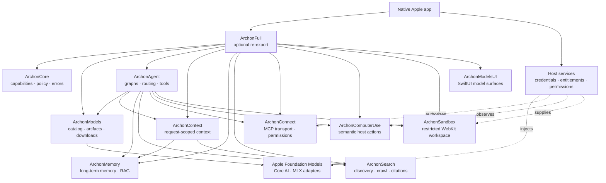

# Archon Swift

[](https://www.swift.org)
[](https://developer.apple.com)

Archon is a modular, local-first Swift SDK for building native AI features on
Apple platforms. It composes model lifecycle, agent graphs, context, memory,
research, tools, sandboxing, MCP, semantic actions, and SwiftUI surfaces.

Each product is independently adoptable. `ArchonFull` is the optional
all-products re-export.

## At a glance

| Property | Value |
| --- | --- |
| Language | Swift 6.4, strict-concurrency settings |
| Platforms | iOS 27, macOS 27, visionOS 27 |
| Package manager | Swift Package Manager |
| Runtime posture | Apple-first; Core AI and MLX adapters where available |
| Default safety posture | Typed errors, bounded operations, fail closed |
| App boundary | The consuming app owns credentials, entitlements, permissions, and host adapters |

## Why Archon

- Native Swift APIs instead of a server-first control plane.
- Local model discovery, compatibility checks, downloads, validation, and installation.
- Composable agent graphs with model routing, tools, interrupts, checkpoints, and evaluation.
- Application-owned memory and RAG with optional CloudKit synchronization.
- Search and research outputs with citations and an inspectable search path.
- Permission-aware MCP, semantic host actions, and capability-restricted WebKit sandboxes.
- No fabricated inference, extraction, search, telemetry, or platform records when a required capability is unavailable.

## System design



Arrows show composition and service boundaries, not the complete SwiftPM
dependency graph. Read [`Documentation/architecture.md`](Documentation/architecture.md)
for the deeper design notes.

## Products

| Product | Responsibility |
| --- | --- |
| `ArchonCore` | Shared capabilities, device facts, policy, logging, and errors |
| `ArchonModels` | Catalogs, Hugging Face discovery, model formats, compatibility, downloads, manifests, and lifecycle |
| `ArchonAgent` | Stateful graphs, routing, providers, tools, interrupts, checkpoints, evaluation, and SwiftUI chat |
| `ArchonContext` | Request-scoped context assembly; never persists or executes actions |
| `ArchonMemory` | Application-owned memory, graph storage, vector search, RAG, and CloudKit sync |
| `ArchonSearch` | Search, scraping, deep research, structured extraction, citations, and monitoring |
| `ArchonSandbox` | Capability-restricted WebKit mini-apps, DOM/JS patches, events, and workspace sync |
| `ArchonConnect` | MCP client, JSON-RPC HTTP transport, schema validation, and permission policy |
| `ArchonComputerUse` | Semantic snapshots and host-defined actions with risk and postcondition checks |
| `ArchonModelsUI` | SwiftUI model discovery, installed-library, detail, storage, and download views |
| `ArchonFull` | Convenience re-export of the SDK family |

## Capability comparison

Legend: ✅ first-class in the project · ⚠️ adjacent, partial, or adapter-owned ·
❌ outside the product’s core scope. This is a concise positioning snapshot,
not a performance ranking; there is no uniform market-share ranking for these
different categories.
Grouped competitor columns summarize the category; `⚠️` means coverage is
partial, adapter-owned, or varies between the competitors in that group.

| Feature | [Archon Swift](https://github.com/VM451/archon-swift) | Apple-native SDKs<br/>[Apple FM](https://developer.apple.com/documentation/foundationmodels) | Agent frameworks<br/>[LangGraph](https://langchain-ai.github.io/langgraph/) · [LlamaIndex](https://www.llamaindex.ai/) | Memory / RAG<br/>[Mem0](https://docs.mem0.ai/introduction) · LlamaIndex | Search / research<br/>ChatGPT Search · Brave Search · Perplexity · [Tavily](https://docs.tavily.com/) · [Firecrawl](https://docs.firecrawl.dev/) · [Exa](https://exa.ai/docs) · [SerpAPI](https://serpapi.com/) · [SearXNG](https://docs.searxng.org/) · [Perplexica](https://github.com/ItzCrazyKns/Perplexica) · [TinyFish](https://docs.tinyfish.ai/) | Protocol / connectivity<br/>[MCP Swift SDK](https://github.com/modelcontextprotocol/swift-sdk) | Browser / action agents<br/>TinyFish · Stagehand |
| --- | :---: | :---: | :---: | :---: | :---: | :---: | :---: |
| Apple-native Swift | ✅ | ✅ | ❌ | ❌ | ❌ | ✅ | ❌ |
| Swift 6 strict concurrency | ✅ | ⚠️ | ❌ | ❌ | ❌ | ⚠️ | ❌ |
| On-device model lifecycle | ✅ | ✅ | ⚠️ | ❌ | ❌ | ❌ | ❌ |
| Model catalogs & discovery | ✅ | ❌ | ⚠️ | ❌ | ❌ | ❌ | ❌ |
| Artifact integrity & atomic install | ✅ | ❌ | ❌ | ❌ | ❌ | ❌ | ❌ |
| Resumable/background downloads | ✅ | ❌ | ❌ | ❌ | ❌ | ❌ | ❌ |
| Agent graphs | ✅ | ⚠️ | ✅ | ⚠️ | ⚠️ | ❌ | ⚠️ |
| Checkpoints & state replay | ✅ | ❌ | ⚠️ | ❌ | ❌ | ❌ | ⚠️ |
| Human approval / interrupts | ✅ | ⚠️ | ⚠️ | ❌ | ⚠️ | ⚠️ | ⚠️ |
| Multi-agent / subgraphs | ✅ | ⚠️ | ✅ | ⚠️ | ⚠️ | ❌ | ⚠️ |
| Evaluation / tracing / cost | ✅ | ⚠️ | ⚠️ | ⚠️ | ⚠️ | ❌ | ⚠️ |
| Structured output / extraction | ✅ | ✅ | ⚠️ | ⚠️ | ⚠️ | ⚠️ | ⚠️ |
| App-owned memory / RAG | ✅ | ❌ | ⚠️ | ✅ | ⚠️ | ❌ | ❌ |
| Document ingestion / multimodal | ✅ | ✅ | ⚠️ | ✅ | ⚠️ | ⚠️ | ⚠️ |
| Web research | ✅ | ❌ | ⚠️ | ❌ | ✅ | ❌ | ⚠️ |
| Citation / provenance | ✅ | ❌ | ⚠️ | ⚠️ | ⚠️ | ❌ | ❌ |
| Search monitoring | ✅ | ❌ | ⚠️ | ❌ | ⚠️ | ❌ | ⚠️ |
| MCP | ✅ | ❌ | ⚠️ | ⚠️ | ⚠️ | ✅ | ⚠️ |
| Host semantic actions | ✅ | ⚠️ | ❌ | ❌ | ⚠️ | ❌ | ✅ |
| Restricted sandbox | ✅ | ❌ | ❌ | ❌ | ❌ | ❌ | ❌ |
| CloudKit / offline sync | ✅ | ❌ | ❌ | ❌ | ❌ | ❌ | ❌ |
| App Intents | ✅ | ❌ | ❌ | ❌ | ❌ | ❌ | ❌ |
| Permission / fail-closed policies | ✅ | ⚠️ | ⚠️ | ⚠️ | ⚠️ | ⚠️ | ⚠️ |
| SwiftUI surfaces | ✅ | ❌ | ❌ | ❌ | ❌ | ❌ | ❌ |

Archon’s distinction is the integrated Apple application boundary: specialist
tools can still be used behind Archon protocols or host adapters.

## Quick start

Add the package URL in Xcode or Swift Package Manager:

```swift
.package(url: "https://github.com/VM451/archon-swift.git", branch: "main")
```

Use only the products you need:

```swift
import ArchonModels

let catalog = HuggingFaceCatalog()
let models = try await catalog.search(ModelSearchRequest(query: "Qwen"))
let fit = ModelCompatibilityAnalyzer.analyze(
    variant: models[0].variants[0],
    device: .current
)
```

For a complete host composition, run:

```bash
swift run archon-example-app
```

## Model lifecycle

`ArchonModels` supports static and HTTP-backed catalogs, Hugging Face metadata,
Keychain-backed tokens, device-fit analysis, single-file or directory
artifacts, checksum and resource validation, resumable foreground/background
downloads, atomic installation, revision checks, and App Intents.

Runnable Core AI and MLX artifacts are distinct from raw `GGUF`, `SafeTensors`,
and Transformers files. Unsupported or conversion-required artifacts are never
reported as Ready. See [`Documentation/model-format.md`](Documentation/model-format.md).

The developer-only `archon-model` executable handles inspection, validation,
packaging, conversion through Apple’s `coreai-models` exporter, and real local
artifact preparation benchmarks.

## Build and test

```bash
swift build -j 2
swift test --no-parallel -j 2 --disable-sandbox
```

Optional live research tests and timing-sensitive benchmarks are disabled by
default. See [`Benchmarks/README.md`](Benchmarks/README.md).

## Integration boundaries

The package is a SwiftPM library family with a buildable SwiftUI example host,
not a signed Xcode application. A production app supplies its own:

- model tokenizer/text adapters and provider credentials;
- privacy usage descriptions, entitlements, and platform permissions;
- MCP servers, search services, lifecycle forwarding, and host semantic observations;
- user-facing policy for side effects and data retention.

When one of these boundaries is absent, the relevant API returns a typed error
or an unavailable result. Test and preview code can inject deterministic mocks.

## Documentation

- [`Documentation/architecture.md`](Documentation/architecture.md) — design boundaries and lifecycle rules.
- [`Documentation/model-format.md`](Documentation/model-format.md) — manifest and artifact contract.
- [`Documentation/migration-audit.md`](Documentation/migration-audit.md) — unified-package migration scope.
- [`Examples/README.md`](Examples/README.md) — buildable SwiftUI host.
- [`Benchmarks/README.md`](Benchmarks/README.md) — opt-in performance checks.

## Governing rule

Use Apple when Apple already solves the problem. Add only the missing adapter
when it does not. Report unsupported behavior honestly when no safe adapter
exists.
