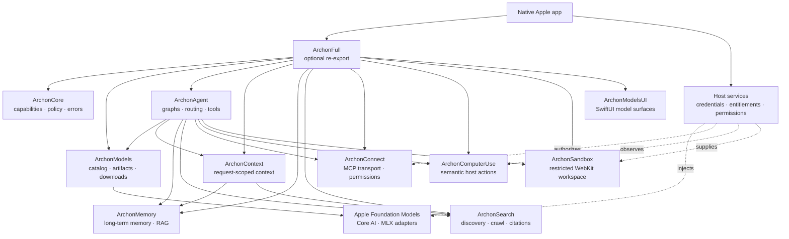

# Archon Swift

[](https://www.swift.org)
[](https://developer.apple.com)

Archon is a modular, local-first Swift SDK for building native AI features on
Apple platforms. It composes model lifecycle, agent graphs, context, memory,
research, tools, sandboxing, MCP, semantic actions, and SwiftUI surfaces.

Each product is independently adoptable. `ArchonFull` is the optional
all-base-products re-export; optional adapters remain separate.

## At a glance

| Property | Value |
| --- | --- |
| Language | Swift 6.4, strict-concurrency settings |
| Platforms | iOS 27, macOS 27, visionOS 27 |
| Package manager | Swift Package Manager |
| Runtime posture | Apple-first; Core AI and MLX adapters where available |
| Default safety posture | Typed errors, bounded operations, fail closed |
| App boundary | The consuming app owns credentials, entitlements, permissions, and host adapters |

## Why Archon

- Native Swift APIs instead of a server-first control plane.
- Local model discovery, compatibility checks, downloads, validation, and installation.
- Composable agent graphs with model routing, tools, interrupts, checkpoints, and evaluation.
- Application-owned memory and RAG with optional CloudKit synchronization.
- Search and research outputs with citations and an inspectable search path.
- Permission-aware MCP, semantic host actions, and capability-restricted WebKit sandboxes.
- No fabricated inference, extraction, search, telemetry, or platform records when a required capability is unavailable.

## System design



Arrows show composition and service boundaries, not the complete SwiftPM
dependency graph. Read [`Documentation/architecture.md`](Documentation/architecture.md)
for the deeper design notes.

## Products

| Product | Responsibility |
| --- | --- |
| `ArchonCore` | Shared capabilities, device facts, policy, logging, and errors |
| `ArchonModels` | Catalogs, Hugging Face discovery, model formats, compatibility, downloads, manifests, and lifecycle |
| `ArchonAgent` | Stateful graphs, routing, providers, tools, interrupts, checkpoints, evaluation, and SwiftUI chat |
| `ArchonContext` | Request-scoped context assembly; never persists or executes actions |
| `ArchonMemory` | Application-owned memory, graph storage, vector search, RAG, and CloudKit sync |
| `ArchonMemoryProxima` | Optional ProximaKit dense-index adapter behind ArchonMemory's vendor-neutral `VectorIndex` contract |
| `ArchonSearch` | Search, scraping, deep research, structured extraction, citations, and monitoring |
| `ArchonSandbox` | Capability-restricted WebKit mini-apps, DOM/JS patches, events, and workspace sync |
| `ArchonConnect` | MCP client, JSON-RPC HTTP transport, schema validation, and permission policy |
| `ArchonComputerUse` | Semantic snapshots and host-defined actions with risk and postcondition checks |
| `ArchonModelsUI` | SwiftUI model discovery, installed-library, detail, storage, and download views |
| `ArchonFull` | Convenience re-export of the base SDK products; intentionally excludes optional `ArchonMemoryProxima` |

## Dependency and product policy

The package is deliberately layered so an app can adopt only the capabilities
it needs. `ArchonFull` re-exports the base SDK products, but it does not pull in
the optional Proxima index adapter. Import `ArchonMemoryProxima` only when its
additional dependency and performance trade-offs are justified by your device
benchmarks.

The heavier integrations remain scoped to their owning products:

| If you need… | Import | Additional dependency scope |
| --- | --- | --- |
| Shared policies, device facts, errors | `ArchonCore` | None |
| Catalogs, artifacts, downloads, model UI | `ArchonModels`, `ArchonModelsUI` | Model catalog/runtime integrations are opt-in at the API boundary |
| Graph agents and local model adapters | `ArchonAgent` | MLX, MLX LM, Hugging Face, Transformers, and Swift macros |
| Durable memory and RAG | `ArchonMemory` | GRDB/SQLite |
| Alternative dense indexing | `ArchonMemoryProxima` | ProximaKit; optional and not included in `ArchonFull` |
| MCP connectivity | `ArchonConnect` | Official MCP Swift SDK |
| Search, sandbox, semantic actions | `ArchonSearch`, `ArchonSandbox`, `ArchonComputerUse` | Archon-owned contracts; host/provider integrations remain explicit |

No cloud-vendor SDK is required by the base local policies. Cloud models,
search services, remote MCP servers, and remote sandboxes belong behind the
consuming app's explicit adapter and permission boundary.

## Competitive comparison

This comparison answers two different questions that are often mixed together:

1. **Does the product have the capability?** This is capability evidence.
2. **Can it replace a local, native Swift implementation in an Apple app?**
   This is the local qualification gate.

Cloud APIs, hosted browsers, Python/TypeScript runtimes, and local HTTP servers
can be excellent products without being local-core replacements for Archon.
Archon can still use them through explicit adapters when the consuming app
allows the network.

Legend: ✅ local/in-process Apple Swift path · ⚠️ partial, optional, or adapter
path · ☁️ cloud/remote or server runtime · — inspiration only. This is a
positioning and design comparison, not a market-share or benchmark ranking.

### Decision summary

| If your priority is… | Strong market reference | What that reference is best at | Archon answer | Local qualification |
| --- | --- | --- | --- | :---: |
| Automatic long-term memory | [Mem0](https://docs.mem0.ai/features/contextual-add), [Supermemory](https://docs.supermemory.ai/memory-api/introduction) | Fact extraction, deduplication, contradiction handling, connectors, filtering, and profile synthesis | `ArchonMemory` owns the durable local lifecycle, scopes, temporal facts, graph, hybrid retrieval, forget/export, and audit | ✅ |
| Temporal truth and invalidation | [Zep](https://help.getzep.com/v2/concepts) | Temporal knowledge graph and invalidated facts | `MemoryItem` validity/supersession plus local `GraphStore` and history | ✅ |
| Agent-controlled working context | [Letta](https://docs.letta.com/api/typescript) | Self-editing memory blocks and hierarchical context | `CoreMemoryBlock` plus ephemeral `ArchonContext` contributors and explicit scopes | ✅ |
| Durable graph workflows | [LangGraph persistence](https://docs.langchain.com/oss/python/langgraph/persistence) | Checkpoints, recovery, interrupts, replay, and time travel | `ArchonAgent` graph/checkpointer/interrupt/replay contracts in Swift | ✅ |
| Multi-agent delegation | [OpenAI Agents SDK](https://openai.github.io/openai-agents-python/agents/), [CrewAI](https://docs.crewai.com/index) | Tools, handoffs, sessions, guardrails, flows, and observability | Typed handoffs, subgraphs, tools, sessions, guardrails, streaming, and tracing | ✅ |
| Agent-ready web research | [Tavily](https://docs.tavily.com/welcome), [Exa](https://exa.ai/docs/reference/search), [Firecrawl](https://docs.firecrawl.dev/api-reference/endpoint/scrape) | Search plus crawl, map, extract, rerank, freshness, and research workflows | Local corpus first; `ArchonSearch` orchestrates crawl, extraction, citations, and explicit cloud adapters | ✅ / ⚠️ |
| Independent or controllable search | [Brave Search](https://brave.com/search/api/), [SearXNG](https://docs.searxng.org/) | Independent index or self-hosted metasearch control | `SearchProvider` separates offline corpus search from network providers and records network use | ✅ / ⚠️ |
| Secure code execution | [E2B](https://e2b.dev/), [Modal](https://modal.com/docs/guide/sandboxes), [Deno Sandbox](https://docs.deno.com/sandbox/security/) | MicroVM/container isolation, snapshots, lifecycle, secrets, and network policy | Local WebKit boundary first; remote microVM/container adapters remain visibly remote | ✅ / ⚠️ |
| Browser task automation | [Stagehand](https://docs.stagehand.dev/v2/first-steps/quickstart), [TinyFish](https://docs.tinyfish.ai/) | Observe, act, extract, and goal-oriented browser workflows | Semantic Computer Use first, with screenshot control only as an approved fallback | ✅ / ⚠️ |
| Native on-device inference | [Foundation Models](https://developer.apple.com/documentation/FoundationModels), [Core ML](https://developer.apple.com/documentation/CoreML) | Apple-supported local generation, guided output, tool calling, and hardware acceleration | Reuse Apple runtimes behind `ArchonModels` and `LLMProvider`; build lifecycle and policy around them | ✅ |
| Interoperable tools and resources | [MCP specification](https://modelcontextprotocol.io/specification/2024-11-05/index), [MCP Swift SDK](https://github.com/modelcontextprotocol/swift-sdk) | Tools, resources, prompts, schemas, progress, cancellation, and consent | Reuse the official Swift SDK; retain Archon authorization, consent, errors, and lifecycle boundaries | ✅ / ⚠️ |

### Signature-feature comparison

The rows below identify the feature that makes each reference worth studying.
The “Archon stance” is intentionally outcome-oriented: reuse a current Apple
primitive, adapt a qualifying implementation behind an Archon contract, or
build the missing local behavior. The complete row-level evidence, confidence,
and quality gates live in the [signature-feature registry](context/competitor-signature-features.md).

#### Memory

| Competitor | Signature strength | Why it retains users | Local/native fit | Archon stance |
| --- | --- | --- | :---: | --- |
| [Mem0](https://docs.mem0.ai/features/contextual-add) | Automatic extraction, dedupe, contradictions, hybrid retrieval | Useful memory appears without manual curation | ☁️ | Adapt the semantics; build local durable storage and audit |
| [Supermemory](https://docs.supermemory.ai/memory-api/introduction) | Broad ingestion/connectors, multimodality, reranking, profile synthesis | Users can bring in many sources and get a unified profile | ☁️ | Adapt the outcome into local ingestion, provenance, and context synthesis |
| [Zep](https://help.getzep.com/v2/concepts) | Temporal knowledge graph and fact invalidation | Time-aware truth is safer for long-running agents | ☁️ | Build local validity, supersession, graph, and history semantics |
| [Letta](https://docs.letta.com/api/typescript) | Self-editing working-memory blocks and hierarchical context | The agent controls what stays immediately visible | ☁️ | Adapt block semantics through `CoreMemoryBlock` and `ArchonContext` |
| [CrewAI Memory](https://github.com/crewAIInc/crewAI/blob/main/docs/v1.15.12/en/concepts/memory.mdx) | Unified scoped memory with semantic, recency, and importance recall | Multiple agents share one coherent memory model | ☁️ | Build explicit user/agent/run scopes and deterministic hybrid scoring |

#### Agents

| Competitor | Signature strength | Why it retains users | Local/native fit | Archon stance |
| --- | --- | --- | :---: | --- |
| [LangGraph](https://docs.langchain.com/oss/python/langgraph/persistence) | Durable checkpoints, interrupts, recovery, state inspection, and time travel | Long-running workflows can pause and resume without losing state | ☁️ | Adapt the orchestration patterns into the Swift graph runtime |
| [CrewAI](https://docs.crewai.com/index) | Crews, Flows, memory, guardrails, and observability | Role-based teams can grow into event-driven workflows | ☁️ | Adapt the useful workflow and observability patterns |
| [OpenAI Agents SDK](https://openai.github.io/openai-agents-python/agents/) | Tools, handoffs, sessions, guardrails, structured outputs | Small composable primitives make delegation predictable | ☁️ | Adapt into typed Swift tools, handoffs, sessions, and policies |
| [LlamaIndex](https://www.llamaindex.ai/) | Data connectors, retrieval composition, agent workflows, and evaluation | Heterogeneous data can be connected quickly | ☁️ | Use as a retrieval/workflow reference; keep Archon storage local and owned |
| [PydanticAI](https://ai.pydantic.dev/) | Schema-first tools and structured outputs | Strong contracts make agent behavior easier to test | ☁️ | Reuse the principle through Swift `Codable`, typed errors, and schemas |

#### Search and research

| Competitor | Signature strength | Why it retains users | Local/native fit | Archon stance |
| --- | --- | --- | :---: | --- |
| [Tavily](https://docs.tavily.com/welcome) | Agent-oriented search, extract, crawl, map, and research | Search results arrive as compact agent context | ☁️ | Build local orchestration; add Tavily as an explicit adapter |
| [Exa](https://exa.ai/docs/reference/search) | Neural search, highlights, contents, freshness, and structured search | Semantic relevance and model-ready passages reduce research work | ☁️ | Adapt ranking/content contracts; preserve local corpus mode |
| [Firecrawl](https://docs.firecrawl.dev/api-reference/endpoint/scrape) | Scrape, crawl, map, structured extraction, and browser interaction | Difficult sites become usable structured data | ☁️ | Adapt extraction outcomes through local WebKit/URLSession and cloud adapters |
| [Brave Search](https://brave.com/search/api/) | Independent index, citations, and controllable result filtering | Search independence and control are valuable to privacy-sensitive apps | ☁️ | Add behind `SearchProvider`; do not make network search the local core |
| [Perplexity](https://docs.perplexity.ai/) | Conversational answer synthesis with citations | The answer and evidence trail arrive together | ☁️ | Adapt claim-to-source and citation contracts |
| [ChatGPT Search](https://help.openai.com/en/articles/9237897-chatgpt-search) | Conversational web research and follow-up context | Users can research naturally instead of managing query syntax | ☁️ | Use the workflow as inspiration; make network use explicit |
| [SerpAPI](https://serpapi.com/) | Normalized results across engines and verticals | Provider switching does not require rewriting parsers | ☁️ | Optional adapter behind the provider-neutral search contract |
| [SearXNG](https://docs.searxng.org/) / [Perplexica](https://github.com/ItzCrazyKns/Perplexica) | Self-hosted metasearch and customizable research UX | Operators can control deployment and source selection | ⚠️ / ☁️ | Inspiration or remote adapter; not an in-process Swift replacement |

#### Sandbox and action

| Competitor | Signature strength | Why it retains users | Local/native fit | Archon stance |
| --- | --- | --- | :---: | --- |
| [E2B](https://e2b.dev/) | Disposable Firecracker microVM/code interpreter | Strong isolation with a convenient execution API | ☁️ | Preserve the outcome behind remote `.remoteMicroVM` adapters |
| [Modal](https://modal.com/docs/guide/sandboxes) | Secure containers, lifecycle controls, snapshots, and forks | Reproducible environments with fast lifecycle operations | ☁️ | Adapt lifecycle/snapshot concepts without mislabelling local WebKit |
| [Daytona](https://www.daytona.io/docs/sandboxes) | Managed development workspaces | Agents receive repeatable workspaces instead of bespoke infrastructure | ☁️ | Optional remote workspace adapter |
| [Deno Sandbox](https://docs.deno.com/sandbox/security/) | Ephemeral VM, network policy, secret redaction, cleanup, and audit | Security defaults reduce untrusted-code risk | ☁️ | Build deny-by-default local policy and audit; keep VM execution remote |
| [Browserbase](https://docs.browserbase.com/) | Hosted browser sessions and operational tooling | Browser state and reliability are supplied as a service | ☁️ | Optional remote observation/action adapter |
| [Stagehand](https://docs.stagehand.dev/v2/first-steps/quickstart) | `observe`, `act`, `extract`, and autonomous browser workflows | One API covers semantic inspection and browser actions | ☁️ | Build semantic observation/action/extraction contracts |
| [OpenAI Computer Use](https://developers.openai.com/api/docs/guides/tools-computer-use) | Screenshot-driven click, type, scroll, key, and window actions | Models can operate unfamiliar visual interfaces | ☁️ | Screenshot fallback only, with explicit approval and postconditions |
| [Anthropic Computer Use](https://platform.claude.com/docs/en/agents-and-tools/tool-use/computer-use-tool) | Client-executed screenshot/click/type/zoom controls | The client retains control of side effects | ☁️ | Adapt the approval/audit pattern to semantic host actions |

#### Models, runtimes, and protocols

| Reference | Signature strength | Local/native fit | Archon stance |
| --- | --- | :---: | --- |
| [Foundation Models](https://developer.apple.com/documentation/FoundationModels) | Apple on-device generation, guided output, and tool calling | ✅ | Reuse through `ArchonModels`/`LLMProvider` |
| [Core ML](https://developer.apple.com/documentation/CoreML) | Hardware-accelerated local inference and compiled artifacts | ✅ | Reuse; build artifact validation, lifecycle, and routing |
| [MLX Swift](https://github.com/ml-explore/mlx-swift) | Apple Silicon local tensor/runtime path for open models | ✅ | Adapt behind the MLX provider; split only if binary evidence justifies it |
| [Hugging Face Swift](https://github.com/huggingface/swift-transformers) | Tokenizers, Hub metadata/downloads, and model ecosystem access | ✅ / ⚠️ | Adapt catalog/artifact tooling; validate runtime compatibility explicitly |
| [AnyLanguageModel](https://github.com/huggingface/AnyLanguageModel) / [Conduit](https://github.com/christopherkarani/Conduit) | Provider-neutral model/session abstractions | ⚠️ | Compare narrowly against `LLMProvider`; no vendor types in defaults |
| [SwiftAgent](https://github.com/SwiftedMind/SwiftAgent) / [AgentRunKit](https://github.com/Tom-Ryder/AgentRunKit) | Native Swift agent/session and checkpoint patterns | ✅ / ⚠️ | Candidate references; Archon already owns broader graph/persistence policy |
| [Swarm](https://github.com/christopherkarani/Swarm) | Lightweight handoffs and multi-agent coordination | ⚠️ | Adapt handoff semantics; require durable state and authorization |
| [MCP Swift SDK](https://github.com/modelcontextprotocol/swift-sdk) | Official Swift implementation of interoperable tools/resources/prompts | ✅ | Reuse protocol implementation; retain Archon policy and lifecycle |
| [A2A](https://a2a-protocol.org/latest/specification/) / [AG-UI](https://docs.ag-ui.com/) | Emerging agent-to-agent and agent-to-UI interoperability | ⚠️ | Keep pending until identity, auth, replay, cancellation, and device boundaries are proven |

### What Archon is actually promising

| Dimension | Archon default | Cloud/remote extension |
| --- | --- | --- |
| Execution | Primarily on the user's Apple device, in-process, native Swift | Explicit opt-in adapters for hosted models, search, MCP, browsers, or sandboxes |
| Privacy | `localOnly` never calls the network; credentials belong to the host app | Every cloud boundary is policy-controlled and observable |
| Apple integration | Reuse Foundation Models, Core ML, WebKit, SwiftUI, CloudKit, App Intents, and Accessibility | Do not replace an Apple framework that already satisfies the requirement |
| Data ownership | ArchonMemory and ArchonContext remain application-owned and auditable | Sync and hosted indexes are optional, explicit, and never silently authoritative |
| Quality bar | Typed failures, strict concurrency, cancellation, bounded resources, recovery, and migration | Adapters must disclose limitations and pass the same contract tests |
| Isolation honesty | In-process WebKit is labelled WebKit, not a process/container/microVM | Remote isolation levels are represented explicitly by the adapter |

### Evidence status

The maintained [competitor signature registry](context/competitor-signature-features.md)
records capability evidence separately from independent user-pull evidence. A
feature is not called “user-loved” from official documentation alone. The
[adoption backlog](context/feature-adoption-backlog.md) maps each outcome to an
Archon product, decision, priority, and definition of done. The
[quality scorecard](context/quality-scorecard.md) defines the weighted score and
the gates required before a replacement becomes the default.

The current package evidence is 325 Swift tests across 10 bundles, independent
product builds, simulator compilation, dependency-scope checks, and license
inventory checks. Signed-app, physical-device, live UI, real-model, and
production-server validation remain explicit release gates.

## Quick start

Add the package URL in Xcode or Swift Package Manager. The branch form is
convenient while developing against the repository; pin a release tag or
commit in production for reproducible builds:

```swift
.package(url: "https://github.com/VM451/archon-swift.git", branch: "main")
```

Inspect a local model library without introducing a network request:

```swift
import Foundation
import ArchonModels

func findCompatibleModels(in libraryURL: URL) async throws -> [ModelDescriptor] {
    let catalog = LocalModelCatalog(locations: [libraryURL])
    return try await catalog.search(
        ModelSearchRequest(
            query: "",
            compatibleOnly: true,
            device: ArchonDeviceCapabilities.current
        )
    )
}
```

For network-backed Hugging Face discovery, use the separate catalog explicitly
and let the host app decide whether network access is permitted:

```swift
import ArchonModels

func searchHuggingFace() async throws -> [ModelDescriptor] {
    let catalog = HuggingFaceCatalog(tokenStore: KeychainModelTokenStore())
    return try await catalog.search(
        ModelSearchRequest(query: "Qwen", compatibleOnly: true,
                           device: ArchonDeviceCapabilities.current)
    )
}
```

Catalog results can be empty, and a compatible model can still require a
model-family text adapter supplied by the consuming app. Never assume the
first result is runnable; inspect the returned variant and run
`ModelCompatibilityAnalyzer` before presenting an install or load action.

The buildable example is a macOS SwiftPM executable:

```bash
swift run archon-example-app
```

iOS and visionOS validation requires a consuming Xcode application with the
appropriate entitlements, usage descriptions, permissions, and host lifecycle
forwarding. This package-only checkout does not provide a signed `.app`.

## Model lifecycle

`ArchonModels` supports static, local-library, direct-URL, Apple Core AI, and
HTTP-backed catalogs; Hugging Face metadata; Keychain-backed tokens;
device-fit analysis; single-file or directory artifacts; checksum and resource
validation; resumable foreground/background downloads; atomic installation;
revision checks; and App Intents. `LocalModelCatalog` is offline. `HuggingFaceCatalog`
and other HTTP-backed catalogs are network-dependent and must be selected by
the host app deliberately.

Runnable Core AI and MLX artifacts are distinct from raw `GGUF`, `SafeTensors`,
and Transformers files. Unsupported or conversion-required artifacts are never
reported as Ready. See [`Documentation/model-format.md`](Documentation/model-format.md).

The developer-only `archon-model` executable handles inspection, validation,
packaging, conversion through Apple’s `coreai-models` exporter, and real local
artifact preparation benchmarks.

## Local and network policy

Archon makes the execution boundary visible to the caller:

| Capability | Local-first behavior | Explicit network/remote behavior |
| --- | --- | --- |
| Model routing | `ModelPolicy.localOnly`, `appleOnly`, or `preferLocal` selects an on-device path when available | `cloudAllowed` or an explicit cloud provider may cross the host's network boundary |
| Search | `SearchNetworkPolicy.localOnly` accepts a local workspace source and rejects network discovery | `SearchNetworkPolicy.networkAllowed` is required for web/cloud sources |
| Sandbox | `InProcessWebKitExecutionProvider` reports `.inProcessWebKit` and defaults to denied capabilities | Remote container/microVM providers must report their isolation and network dependence |
| Credentials | The consuming app supplies and stores credentials | No API key is embedded in package defaults or silently inferred |

`localOnly` is a hard policy. If a local capability is unavailable, Archon
returns a typed error or unavailable result; it does not silently fall back to
the network.

## Build and test

```bash
swift package dump-package
swift build -j 2
swift test -j 2
swift Tools/verify-product-scope.swift
swift Tools/verify-dependency-licenses.swift
```

Optional live research tests and timing-sensitive benchmarks are disabled by
default. Run the opt-in checks from [`Benchmarks/README.md`](Benchmarks/README.md)
only on a controlled development machine; their timings are not portable device
guarantees.

## Integration boundaries

The package is a SwiftPM library family with a buildable SwiftUI example host,
not a signed Xcode application. A production app supplies its own:

- model tokenizer/text adapters and provider credentials;
- privacy usage descriptions, entitlements, and platform permissions;
- MCP servers, search services, lifecycle forwarding, and host semantic observations;
- user-facing policy for side effects and data retention.

When one of these boundaries is absent, the relevant API returns a typed error
or an unavailable result. Test and preview code can inject deterministic mocks.

## Documentation

- [`Documentation/architecture.md`](Documentation/architecture.md) — design boundaries and lifecycle rules.
- [`Documentation/model-format.md`](Documentation/model-format.md) — manifest and artifact contract.
- [`Documentation/migration-audit.md`](Documentation/migration-audit.md) — unified-package migration scope.
- [`context/competitor-signature-features.md`](context/competitor-signature-features.md) — capability evidence and local/native qualification.
- [`context/feature-adoption-backlog.md`](context/feature-adoption-backlog.md) — feature decisions, priorities, and definitions of done.
- [`context/quality-scorecard.md`](context/quality-scorecard.md) — replacement gates for correctness, safety, performance, and migration.
- [`context/progress-tracker.md`](context/progress-tracker.md) — dated implementation and verification record.
- [`Examples/README.md`](Examples/README.md) — buildable SwiftUI host.
- [`Benchmarks/README.md`](Benchmarks/README.md) — opt-in performance checks.

## Governing rule

Use Apple when Apple already solves the problem. Add only the missing adapter
when it does not. Report unsupported behavior honestly when no safe adapter
exists.
